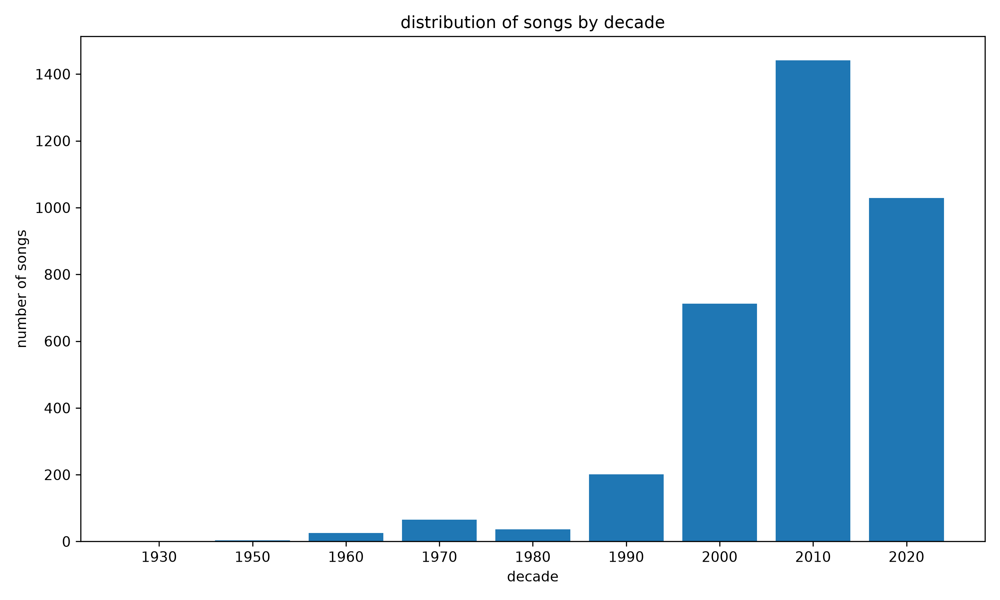
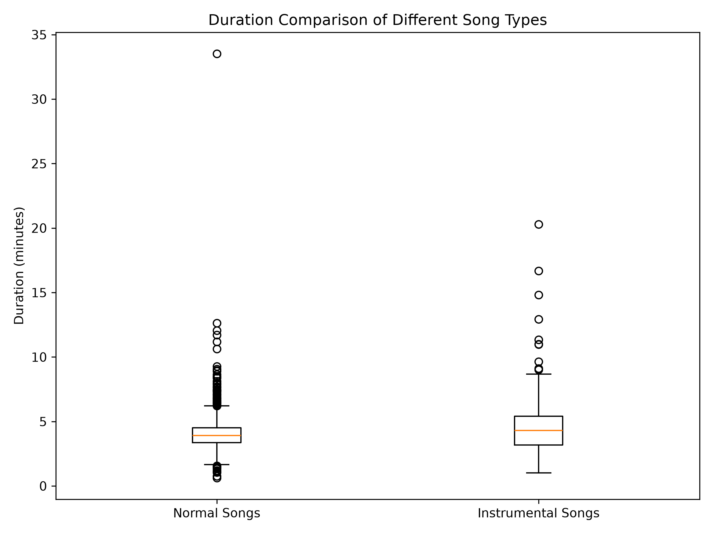
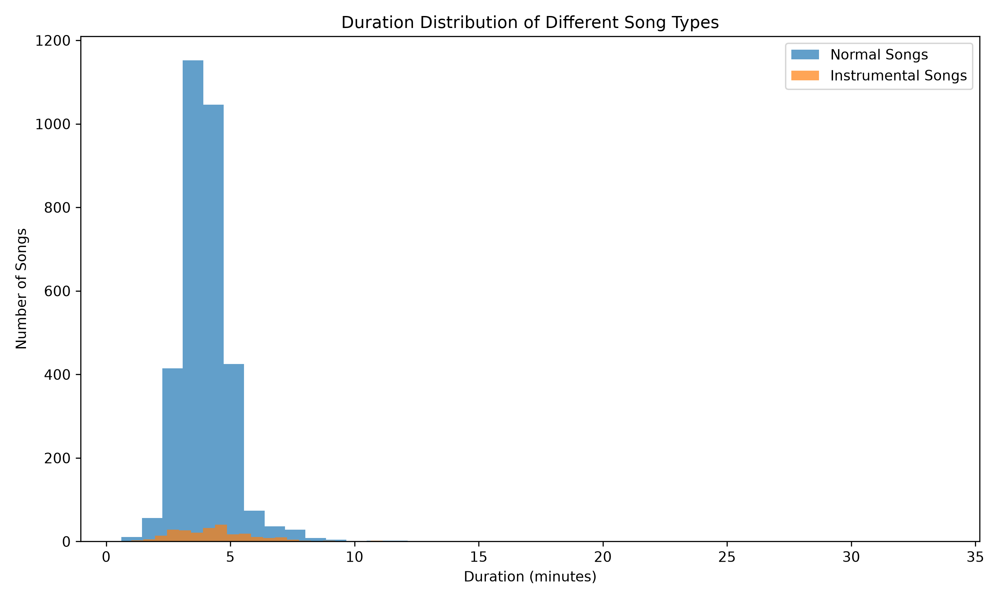
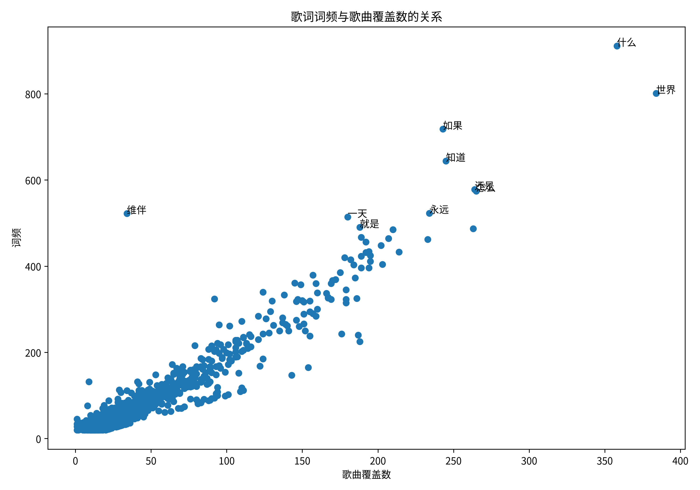
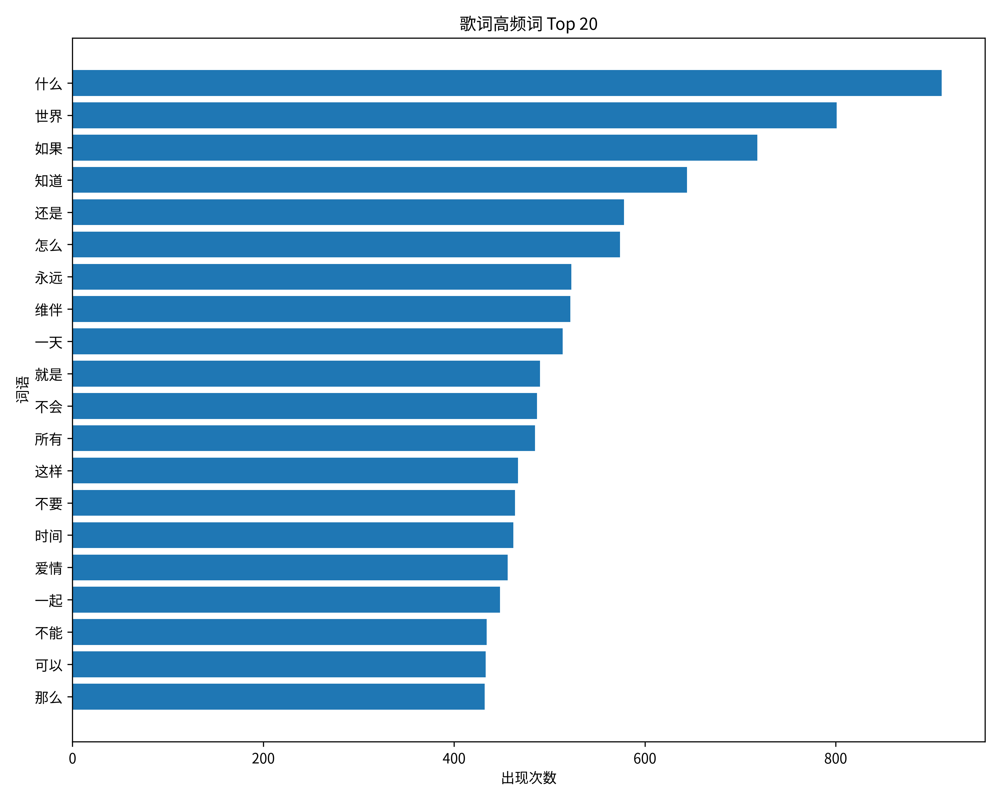

# 数据分析

## 1. 歌曲发布时间的年代分布
根据 `analysis/analysis_time.py` 中的代码运行结果分析，歌曲呈现出明显的**年代集中现象**，样本发行时间主要集中于 2000 年以后。其中，2010 年代共有 1441 首歌曲，占样本总量的约 **41.0%**，是样本最集中的时期；2020 年代共有 1029 首歌曲，占比约 **29.3%**。相比之下，2000 年以前的歌曲仅占约 9.4%。

考虑到本次数据的爬取时间，这一时期的音乐在样本中占比较高是比较合理的。不过，2010 年代的歌曲数量高于 2020 年代，除了音乐流行程度本身可能存在差异外，也与两个年代的**可观测时间跨度不同**有关，因此不能简单地认为 2010 年代的音乐一定比 2020 年代更加流行。
同样值得注意的是，在 21 世纪以前，1970 年代的歌曲数量相对较高，共有 **65 首**，在这一时期的样本中较为突出。这一时期正是流行音乐快速发展的阶段，迪斯科、摇滚、朋克等音乐风格都得到了较大发展。虽然仅凭本次数据无法证明这些音乐风格直接造成了这一结果，但部分 1970 年代的作品在当前样本中仍具有较高的可见度，也从侧面体现出经典音乐具有较长的传播周期和持续的文化影响力。

---

## 2. 纯音乐与普通歌曲的时长差异
根据 `analysis/analysis_duration.py` 中的代码运行结果分析，纯音乐与普通歌曲在时长方面存在较为明显的差异。

普通歌曲的平均时长约为 **4.00 分钟**，中位数约为 **3.90 分钟**；纯音乐的平均时长约为 **4.61 分钟**，中位数约为 **4.30 分钟**。因此，纯音乐的平均时长约比普通歌曲长 **0.6 分钟**，中位数也长约 **0.4 分钟**，说明纯音乐整体上具有更长的典型时长。
进一步观察两类歌曲的时长分布，可以发现纯音乐的时长标准差约为 **2.28 分钟**，而普通歌曲仅约为 **1.14 分钟**，前者约为后者的两倍，说明纯音乐的时长分布更加分散。

此外，对不同的时长阈值进行统计后可以发现，纯音乐的长时长歌曲比例明显高于普通歌曲。当歌曲时长不小于 5 分钟时，纯音乐占比约为 **30.6%**，普通歌曲约为 **11.9%**，前者约为后者的 **2.6 倍**。而随着时长阈值继续提高，两者之间的差距进一步扩大：不小于 10 分钟时，纯音乐的比例已经约为普通歌曲的 **15 倍**；不小于 15 分钟时，这一差距进一步扩大。
因此可以看出，纯音乐与普通歌曲的差异并不仅仅体现在平均时长上，**纯音乐整体更加偏向长时长，同时内部的时长差异也更大，并且更容易出现长时长的歌曲**。

---

## 3. 歌词词频与歌曲覆盖范围的关系
根据 `analysis/analysis_lyric.py` 中的代码，对爬取到的歌曲歌词进行分词和清洗后，分别统计每个词的**总出现次数**以及**包含该词的歌曲数量**。
为了减少低频词对分析结果的影响，选取总出现次数不少于 20 次的词进行进一步分析，并计算词频与歌曲覆盖数之间的 Pearson 相关系数。

分析结果显示，两者的 Pearson 相关系数为 **0.9557**，呈现出很强的正相关关系。从散点图中也可以直观看到，随着一个词的总出现次数增加，其覆盖的歌曲数量总体上也呈增加趋势。
例如，在统计结果中，“生活”一词共出现 **275 次**，出现在 **146 首**不同歌曲中。这说明一个词的高频出现并不一定只是由于少数歌曲进行了大量重复使用，而可能同时意味着该词在较多不同歌曲中都有出现。

因此，在本次爬取的数据中可以观察到：**高频歌词词汇通常也具有更广泛的歌曲覆盖范围**。词频与歌曲覆盖数之间表现出的强相关关系，说明一些常见的歌词表达并不是局限于少数歌曲，而是在不同歌曲中具有较高的普遍性。
需要注意的是，这里的相关系数只能说明两个变量之间存在较强的统计关联，**并不能证明词频的增加会直接导致歌曲覆盖范围扩大**。歌词分词结果中仍可能存在少量未完全清洗的噪声，但其数量相对有限，不影响本次分析的整体趋势。

---

# 总结
通过对歌曲发布时间、歌曲时长以及歌词文本三个方面进行分析，可以得到以下三个较为有意义的结论：
1. **歌曲发布时间存在明显的年代集中现象。**
   本次样本主要集中于 2000 年以后，其中 2010 年代所占比例最高，同时部分更早年代的经典歌曲仍然具有较高的数据可见度。
2. **纯音乐与普通歌曲在时长分布上存在明显差异。**
   纯音乐不仅平均时长和中位数更高，时长分布也更加分散，并且随着时长阈值提高，纯音乐与普通歌曲之间的差距进一步扩大。
3. **歌词词频与歌曲覆盖范围之间存在很强的正相关关系。**
   在满足最低词频要求的词语中，两者的 Pearson 相关系数达到 **0.9557**，说明高频词通常也会出现在更多不同的歌曲中。
